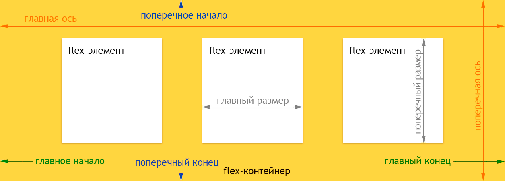

### display: flex
Чтобы использовать flexbox, нужно установить у родителя свойство display:
```css
.flex-container {
    display: flex;
}
```
- **flex** - блочный элемент, выкладывает содержимое согласно флекс-модели.
- **inline-flex** - строчный элемент, выкладывает содержимое согласно флекс-модели

### flex
Сокращённое свойство, которое позволяет указать параметры элемента.
Синтаксис: 
```
flex: none | [ flex-grow flex-shrink? || flex-basis ]
```
Значения по умолчанию: 
```css
flex-grow: 0
flex-shrink: 1
flex-basis: auto
```

например:
```css
.flex-element {
  flex: 1; /* Соответствует flex: 1 1 0% */
}
```

**flex-grow** - сколько пространства может занимать флекс внутри контейнера. Если для всех элементов установлено значение 1, то они получатся равного размера. Если какой-то элемент получил значение 2, то его размер будет в два раза больше остальных.

**flex-shrink** - коэффициент сжатия флексов в контейнере. По умолчанию все flex-элементы могут быть сжаты, но если мы установим значение flex-shrink нулевым (без сжатия), то элементы сохраняют исходный размер.

**flex-basis** - определяет основу флекса. Задаёт размер элемента в px, mm, pt или в процентах вдоль главной оси. При этом размер вычисляется относительно родителя. Отрицательное значение недопустимо.

### flex-direction
**flex-direction** - задаёт направление основных осей в контейнере. (также влияет значение атрибута dir у контейнера)
```flex-direction: row | row-reverse | column | column-reverse```

### flex-wrap
```flex-wrap: nowrap | wrap | wrap-reverse```
- nowrap - в линию.
- wrap - в несколько строк, их направление задаётся свойством flex-direction.
- wrap-reverse - в несколько строк, в направлении, противоположном flex-direction.

## flex-flow 
**flex-flow** - Это свойство является сокращением для установки свойств flex-direction и flex-wrap.
```flex-flow: flex-direction || flex-wrap```
Значения по умолчанию: 
```css
flex-direction: row
flex-wrap: nowrap
```

### justify-content
Определяет, как браузер распределяет пространство вокруг флекс-элементов вдоль главной оси контейнера. Это делается после того, как применяются размеры и автоматические отступы, за исключением ситуации, когда по крайней мере у одного элемента flex-grow больше нуля. При этом не остаётся никакого свободного пространства для манипулирования.
```justify-content: flex-start | flex-end | center | space-between | space-around | space-evenly```
- **flex-start** - Флексы прижаты к началу строки.
- **flex-end** - Флексы прижаты к концу строки.
- **center** - Флексы выравниваются по центру строки.
- **space-between** - Флексы равномерно распределяются по всей строке. Первый и последний элемент прижимаются к соответствующим краям контейнера.
- **space-around** - Флексы равномерно распределяются по всей строке. Пустое пространство перед первым и после последнего элементов равно половине пространства между двумя соседними элементами.
- **space-evenly** - Флексы распределяются так, что расстояние между любыми двумя соседними элементами, а также перед первым и после последнего, было одинаковым.

### [align-items](https://webref.ru/css/align-items)
Свойство **align-items** выравнивает флекс-элементы внутри контейнера в перпендикулярном направлении.
```align-items: flex-start | flex-end | center | baseline | stretch```
- **flex-start** - Флексы выравниваются в начале поперечной оси контейнера.
- **center** - Флексы выравниваются по линии поперечной оси.
- **flex-end** - Флексы выравниваются в конце поперечной оси контейнера.
- **stretch** - Флексы растягиваются таким образом, чтобы занять всё доступное пространство контейнера.
- **baseline** - Флексы выравниваются по их базовой линии.

### [align-content](https://webref.ru/css/align-content)
Свойство **align-content** используется для выравнивания элементов внутри флекс- или грид-контейнера по поперечной оси.
Это свойство работает, когда элементы занимают две и более строки, и не оказывает влияния на элементы выстроенные в одну строку.
```align-content: normal | flex-start | flex-end | center | space-between | space-around | space-evenly | stretch```
normal	normal	Строки располагаются так, словно свойство align-content не указано.
- **flex-start** - Строки располагаются в начале поперечной оси. Каждая следующая строка идёт вровень с предыдущей.
- **center** - Строки располагаются по центру контейнера.
- **flex-end** - Строки располагаются начиная с конца поперечной оси. Каждая предыдущая строка идёт вровень со следующей.
- **space-between** - Строки равномерно распределяются в контейнере и расстояние между ними одинаково.
- **space-around** - Строки равномерно распределяются таким образом, чтобы пространство между двумя соседними строками было одинаковым. Пустое пространство перед первой строкой и после последней строки равно половине пространства между двумя соседними строками.
- **space-evenly** - Строки равномерно распределяются таким образом, чтобы пространство между двумя соседними строками, а также пространство перед первой строкой и после последней строки было одинаковым.
- **stretch** - Строки равномерно растягиваются, заполняя свободное пространство.

### align-self
Свойство **align-self** позволяет переопределить выравнивание по умолчанию (или значение, указанное через align-items) для отдельных flex-элементов. 
```align-self: auto | flex-start | flex-end | center | baseline | stretch```